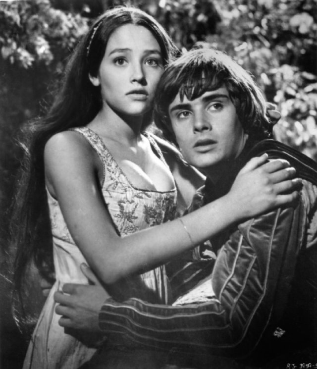

Learning Through Practice
========================================================
author: 
date: 
autosize: true

Say you love Twilight Trilogy
========================================================

Waht does commercial recommendation service do?
========================================================
- What does Amazon do
    

- What does Netflix do

What about a learning service?
========================================================

- A Learning Goal

    
- Current Assessment
    + Twilight

***

- A  Learning Path

    
The Essence of Learning Recommendation
========================================================

- Reveal and **CHANGE** competency

- A dynamic, rather than static, view of competency
    + Item Response Theory does not describe learning, nor should it
    + Adaptive LEarning Knowledge Space assumes learning one step at a time is always feasible

The Key of Learning Recommendation
========================================================

- Heterogeneity is the reason of individualization

- Two types of heterogeneity
    + Different starting points
    + Different speed

Modeling Learning Dynamics        
========================================================

- Mastery is a latent construction
    + Performance is observable but it is not reliable
    + Mastery is constructed by a theory that explains and predicts performance

- A modeling nightmare
    + Try to "imagine" a invisible dynamics

A narrow definition of learning process      
========================================================

+ Mastery is a discrete state that describes the capability to perform a class of similar tasks 
    + procedure knowledge
+ Practice is an exercise on the class of task that produce an observable performance
    + mediation is not a pratice
+ Pedagogical efficacy is the probability of moving a learner from one level of mastery to another after exposing to the practice

The Bayesian Knowledge Tracing Model        
========================================================

- Mastery: $X_t \in \{0,1\}$
- Performance: $Y_t \in \{0,1\}$

***

- Noise
    + Guess $P(Y_t=1|X_t=0)$
    + Slip $P(Y_t=0|X_t=1)$
- Learning $P(X_t=1|X_{t-1}=0)$
- No forgetting $P(X_t=0|X_{t-1}=1)=0$

What is Missing from the BKT model?[1]        
========================================================

- Effort and Engagement
    + Learning taxes grit which is in short supply
    + Selective attrition may overstate pedagogical efficacy if only learners with mastery stays on practicing
    + Disengagement may understate pedagogical efficacy if learners without mastery are not even trying

What is Missing from the BKT model?[2]        
========================================================

- Heterogeneity
    + Binary assumption of the latent state is not innocuous
        + As compared to Zone of Proximity
        + Only one type of learners
    
    + Learners may also differ in speed
        + Given the same starting point, may not reach the same end point

What is Missing from the BKT model?[3]        
========================================================

- Multidimenational mastery
    + What if there are two dimensions of mastery $X^1_t,X^2_t$?

- Non-martingale learning process
    + all grind no revelation?
    + composition of the practice sequence should matter
    

    
A Call to Arms
========================================================

- Build a better LTP model
    + Almost no break through in the past two decades since the publication of BKT in 1994 
    + Computation and Statistics have come a long way since then

***

- Data driven pedagogical research
    + Evidence based rather than experience based content development
    + Combine randomized experiment with the LTP model
    
